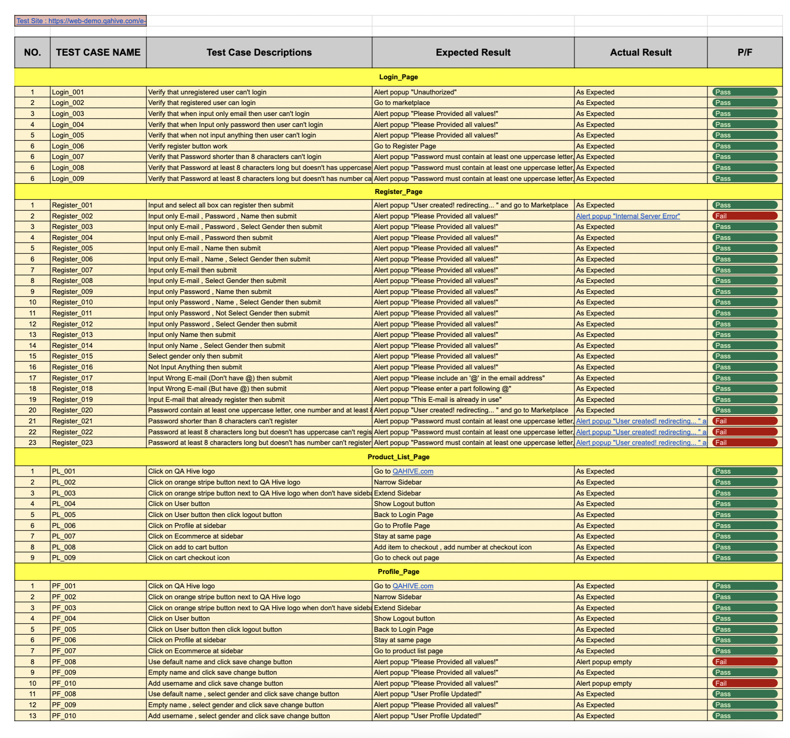
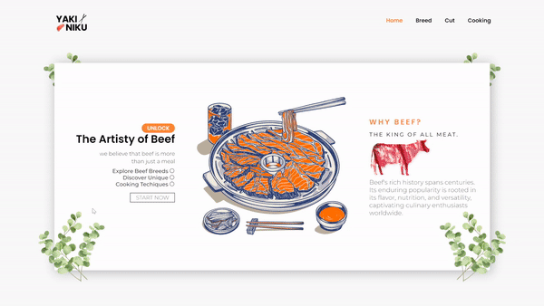
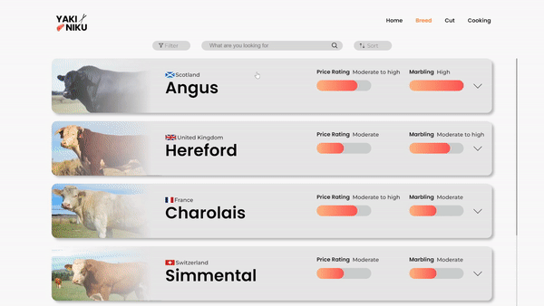
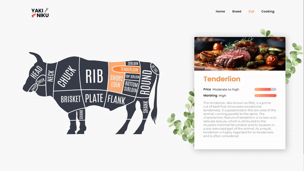
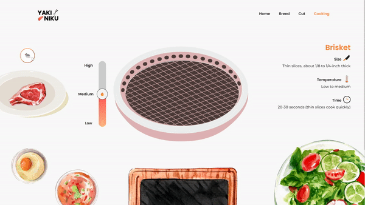

# 👋 Hello there, I'm Teeramet Wongtechit!

I'm a passionate Computer Engineering and Digital Technology student at Chulalongkorn University, Thailand. Welcome to my GitHub portfolio, where I showcase my projects, skills, and experiences in the world of technology.

## About Me

_Teeramet Wongtechit_

- 🧓 Age: 19
- 🌍 Location: Thailand
- 📚 Studying: Computer Engineering & Digital Technology at Chulalongkorn University
- 💡 I am currently **interested** in **manual and automated testing**, **software development**, and 
**web development**.

<h3 align="left">Tools</h3>
Languages and Tools that i can use:

  * __C++__
  * __C#__
  * __HTML__
  * __CSS__
  * __PYTHON__
  * __SELENIUM__
  * __ROBOT FRAMEWORK__
  * __UNITY__
  * __BLENDER__

## Certificates

Here are some certificates or awards I've earned:

 

- 🏅 [Unity Certified User: Programmer](/materials/Unity_Cert.jpg)   From: Unity Software Inc.
- 🏆 [The training course on developing skills in using, developing, or designing products, goods, and services utilizing innovative technologies AR, VR, MR, and 3D](/materials/1209702179951_cert-1.png)  From: Thailand Digital Economy Promotion Agency with the King Mongkut's Institute of Technology Ladkrabang
 
## Contact Me

- 📧 Email: teeramet.wtc@gmail.com

- 🌐 LinkedIn: [Teeramet Wongtechit](https://linkedin.com/in/teeramet-wongtechit)
   
## My Works
---

  <h3>Manual & Automated Testing:</h3>
  <h3><a href="https://github.com/Alknot1122/QAHive_Demo">QA Hive Demo Testing</a></h3>

 
This repository serves as my training ground for practicing testing methods, both manual and automated, using Python and Selenium. Specifically, I focus on testing https://web-demo.qahive.com/, exploring diverse scenarios to enhance my testing skills. Within this space, I experiment with different testing techniques, aiming to improve my proficiency in assessing this particular website. Through Python and Selenium, I conduct automated tests, refining my understanding of testing methodologies.
    

## Previews

 

<h4><a href="https://github.com/Alknot1122/QAHive_Demo/blob/main/Test_Login_Selenium.py">Automated Test with Selenium</a>
  

 

<h4><a href="https://github.com/Alknot1122/QAHive_Demo/blob/main/Testcases.xlsx">Test Case Example</a></h4>

---

#

  <h3>Web Development:</h3>
  <h3><a href="https://github.com/Taihenc/YAKINIKU">Yakiniku</a></h3>

 

YAKINIKU is a website for learning about yakiniku. This site will provide you with a variety of cow breeds along with valuable information. It includes details about each cut, such as its origin and cooking recommendations. Additionally, we offer a mini-game for yakiniku enthusiasts where you can select a beef cut, read the cooking guide, start grilling, and receive a cooking result to gauge your skills.
 

 

__*****IMPORTANT!:  - This is the final project of I2CEDT - This is almost built with pure HTML, JS, CSS (excluding routing things) because it's an I2CEDT-final requirement.__

## Previews

---

